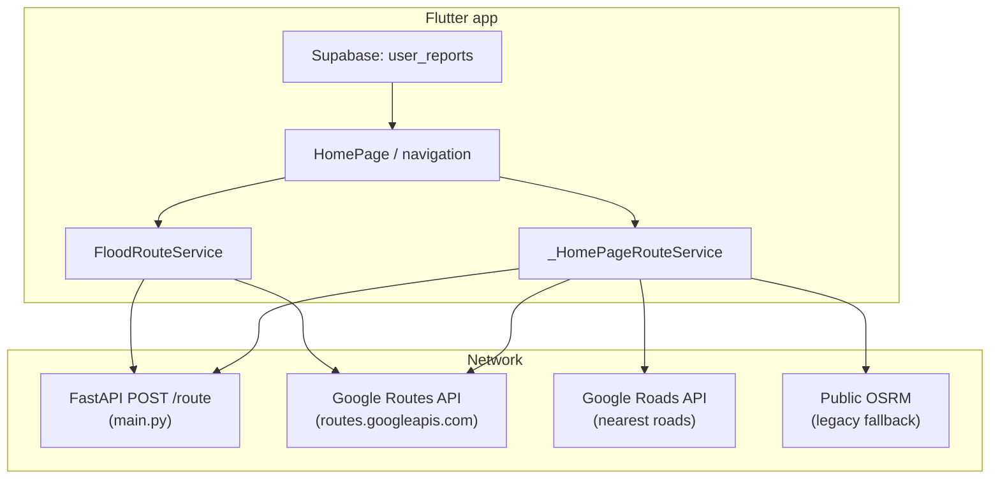
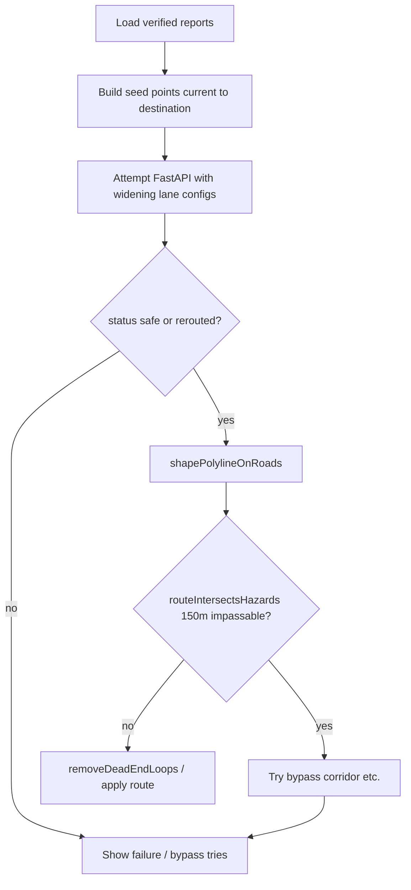

# Safe Flood-Aware Routing — Architecture, Formulas, and Workflows

This document describes how routing works in the First mobile app and companion backend (FastAPI). It reflects the implementation in `lib/services/flood_route_service.dart`, `lib/pages/home_page_route_service.dart`, `main.py`, and related callers.

---

## 1. Executive summary

Routing combines three ideas:

1. **Synthetic corridor graph** — The app builds a multi-lane grid of nodes along a coarse polyline (seed points from GPS → destination). Each edge has a travel cost (distance). Optionally, nodes near flood reports are removed before solving.

2. **Shortest-path solve (A*)** — The FastAPI backend (`main.py`) runs A* on the posted graph to minimize road-distance cost while avoiding blocked edges.

3. **Real roads + hazard clearance** — The Flutter client snaps guidance points to roads (Google Roads / Routes API, or OSRM fallback), then **rejects or repairs** any motor route that comes within **150 m** of an **impassable** hazard (home reroute), or applies **220 m / endpoint tolerances** for other flows (`FloodRouteService`). Google Routes API provides traffic-aware polylines where configured.

“Safest” in code means: **prefer routes that do not intersect hazard disks**; when impossible, fall back to **best-effort** paths with warnings or tie-break using a **complexity score** (distance + turn penalties).

---

## 2. High-level architecture



**ASCII (print-friendly)**

```
+------------------+     +----------------------+
| Supabase         |     | FastAPI /route       |
| user_reports     |---->| A* on posted graph   |
+------------------+     +----------+-----------+
                                    ^
+------------------+                |
| Flutter          |   POST JSON   |
| _HomePageRoute   |--------------+
| FloodRouteService|
| Google Routes/Roads, OSRM
+------------------+
```

---

## 3. Hazard model and distances

### 3.1 Verified hazards

From Supabase `user_reports`, rows used for routing typically filter `admin_decision` to **`impassable`** (and sometimes **`risky`** depending on API).

### 3.2 Point-to-point distance (client)

The Dart client uses `latlong2` **`Distance`** (geodesic), e.g. for points \(A, B\):

- \(d(A,B)\) = `Distance().as(LengthUnit.Meter, A, B)` in meters.

### 3.3 Backend local metric (Python)

For lightweight checks in `main.py`, approximate planar distance:

\[
d_{\mathrm{m}} \approx \sqrt{(\Delta x)^2 + (\Delta y)^2}
\]

with

\[
\Delta y = (\phi_2 - \phi_1) \cdot 111320,\quad
\Delta x = (\lambda_2 - \lambda_1) \cdot 111320 \cdot \cos\left(\frac{\phi_1+\phi_2}{2}\cdot\frac{\pi}{180}\right)
\]

where \(\phi\) is latitude and \(\lambda\) is longitude in degrees (`_euclidean_meters`).

### 3.4 Point-to-segment distance (backend)

For segment \(AB\) and hazard \(P\), the closest point on the segment uses projection parameter \(t \in [0,1]\):

\[
t = \mathrm{clamp}\left( \frac{\vec{AP}\cdot\vec{AB}}{|AB|^2},\, 0,\, 1 \right)
\]

then distance from \(P\) to \((A + t(B-A))\) in meter space (`_point_to_segment_distance_meters`).

---

## 4. Lane-grid graph (client-built payload)

Implemented in **`FloodRouteService.buildDetourPayload`** (also wrapped by `_HomePageRouteService.buildDetourPayload` with **empty** hazard list for the home reroute — see §7).

### 4.1 Seed polyline

Seed points \(\{S_0,\ldots,S_{n-1}\}\) approximate the intended corridor (current position, optional subsamples along an existing route, destination).

### 4.2 Lanes

For each seed index \(i\) and lane index \(\ell \in [-L,\ldots,L]\):

- Base point: \(S_i\).
- Local direction: bearing from \(S_{i-1}\to S_{i+1}\) (endpoints clamped).
- **Lane offset distance**: \(|\ell| \cdot s\) meters where **lane step** \(s\) = `laneStepMeters` (e.g. 180–500 m depending on attempt).
- **Offset bearing**: perpendicular to the local segment — left/right from lane sign.

Node id: `L{lane}_{index}`.

### 4.3 Edges

- **Along-corridor**: connect \((\ell,i)\to(\ell,i+1)\) (bidirectional).
- **Lane changes**: connect \((\ell,i)\to(\ell\pm1,i)\) (bidirectional).

Edge weight: \(w = d(\mathrm{node}_\mathrm{from},\mathrm{node}_\mathrm{to})\) in meters (minimum 0.01 m).

### 4.4 Hazard-based node removal (when hazards are included)

For each hazard \(H\) and graph node \(N\), if \(d(N,H) < 150\) m, the node and incident edges are removed (`flood_route_service.dart`). **Note:** the home-map reroute path passes **no hazards** into this builder; hazards are enforced later on the **road-shaped** polyline (§7).

---

## 5. Backend A* (FastAPI, `main.py`)

### 5.1 Cost and heuristic

Classic A*:

- \(g(n)\): cumulative distance from **start** along chosen edges.
- Heuristic \(h(n)\): straight-line distance from \(n\) to **goal** (`heuristic`).
- **Sort key**: \(f(n) = g(n) + h(n)\).

### 5.2 Edge feasibility

Edges carry `(distance_m, flood_depth_cm, impassable_sign)`. An edge is skipped when:

\[
\text{depth\_cm} \geq 50 \quad \text{OR} \quad \text{impassable\_sign}
\]

(`IMPASSABLE_DEPTH`, `_is_flooded_edge`).

### 5.3 Optional Supabase overlay (server demo)

The backend can mark edges near impassable Supabase reports by increasing depth / impassable flag when a segment passes within **150 m** of a hazard (`_apply_supabase_flood_to_graph`).

### 5.4 Output

Returns node id list and polyline `{lat,lng}` samples for the app to draw and to feed downstream road snapping.

---

## 6. Road shaping and “safest” motor route (Flutter)

Primary implementation: **`_HomePageRouteService.shapePolylineOnRoads`**.

### 6.1 Snap to roads

Guidance points are snapped via **Google Roads nearest roads** when `USE_GOOGLE_ROUTING` and API key are set; else **OSRM** nearest.

### 6.2 Route request

`_computeRoadRoute` prefers **Google Routes API** (`computeRoutes`, `DRIVE`, traffic-aware), else OSRM driving route.

### 6.3 Hazard intersection test (piecewise sampling)

For each segment of the returned route, sample at up to **40** steps with spacing \(\approx 20\) m:

\[
\text{samples} = \left\lceil \frac{\mathrm{segmentLength}}{20} \right\rceil,\quad t_k = \frac{k}{\mathrm{samples}},\; k=0,\ldots,\mathrm{samples}
\]

Point: \(P(t_k) = A + t_k(B-A)\). If any sample is within radius \(r\) of any hazard, the route **intersects** hazards (`routeIntersectsHazards`). Default **\(r = 150\)** m on the home reroute path.

### 6.4 Complexity score (tie-break)

When multiple candidates are still “unsafe”, the code minimizes:

\[
\mathrm{score} = D + 8\sum \Delta_{\mathrm{turn}} + 220\cdot N_{sharp}
\]

where \(D\) is total route length, \(\Delta_{\mathrm{turn}}\) are bearing deltas above **25°** at interior vertices, and \(N_{sharp}\) counts deltas above **60°** (`_routeComplexityScore`).

### 6.5 Deflection and bypass

- **`_deflectRouteAroundHazards`**: pushes waypoints away from hazards along bearings, snaps again, up to **3** passes; safe radius **150** m, push **250** m.
- **`shapeViaBypassCorridor`**: offsets midpoints perpendicular to start→end bearing at various distances (300–2000 m) and \(t\) positions along the chord, snaps, routes through Google/OSRM, picks lowest complexity among hazard-clear routes.

---

## 7. Two important client paths

| Path | Entry | Graph hazards in POST | Road clearance |
|------|--------|------------------------|----------------|
| **Home reroute** | `getSafeAStarRoute` | **None** (empty list to `buildDetourPayload`) | **Impassable** hazards only; **150 m** disk intersection after shaping |
| **FloodRouteService** | `fetchSafestRoute` / `fetchRoadFollowingSafestRoute` | **Yes** — nodes within **150 m** of reports removed | Plus Google direct route check with **220 m** impassable radius; endpoint tolerance **260 m** capped by route length (`_effectiveEndpointTolerance`) |

So the **same JSON graph schema** is used, but **home** relies on **post-routing** geometric checks around **impassable** points; **`fetchSafestRoute`** tightens the **graph** before A*.

---

## 8. Endpoint tolerance (flood_route_service)

Let \(L\) = total route length (m), requested endpoint band \(T\) (e.g. 260 m). Effective band:

\[
T_{\mathrm{eff}} = \min\left(T,\; 120,\; 0.25\,L\right)
\]

Samples within \(T_{\mathrm{eff}}\) of start/end along the polyline **ignore** hazard intersection (so origin/destination inside a reported zone do not alone invalidate the path).

---

## 9. Google-only road following (`fetchRoadFollowingSafestRoute`)

1. Obtain corridor polyline from FastAPI (`fetchSafestRoute` with hazard-aware graph).
2. Request **Google Routes** for direct origin→destination.
3. If direct path stays **≥ 220 m** from **impassable** hazards (except endpoint bands), use it.
4. Else, for each offending hazard, try waypoints at perpendicular offsets **350…1700** m left/right (`_perpendicularDeflectionWaypoint`).
5. If still unsafe, return **best_effort** direct Google route with user warning.

Perpendicular waypoint: from hazard \(H\), bearing perpendicular to OD bearing: \(\theta_\perp = \theta_{OD} \pm 90^\circ\), then offset \(H\) by distance \(d\) along \(\theta_\perp\).

---

## 10. Workflow — Home map safe reroute



**ASCII**

```
verified reports -> seed polyline -> POST FastAPI (lane grid)
    -> polyline OK? -> snap + Google/OSRM shaping
        -> min distance to impassable hazards >= 150m (no segment samples inside disk)?
            yes -> clean loops -> show route
            no  -> bypass / deflect / fail message
```

---

## 11. Source file map

| Concern | Primary location |
|--------|-------------------|
| Lane payload, hazard node stripping, Google direct + deflection | `lib/services/flood_route_service.dart` |
| Home reroute orchestration, shaping, bypass, OSRM fallback | `lib/pages/home_page_route_service.dart` |
| UI trigger | `lib/pages/home_page.dart` (`_getSafeAStarRoute`) |
| Backend A*, distance checks, optional Supabase | `main.py` |

---

## 12. Constants (reference)

Values are fixed in code and may change — verify before citing externally.

| Constant | Typical value | Role |
|----------|----------------|------|
| Hazard disk (home shaping / graph removal) | 150 m | Clearance / node removal |
| Impassable radius (Google flood check) | 220 m | `FloodRouteService` |
| Endpoint tolerance request | 260 m | Capped by `_effectiveEndpointTolerance` |
| Backend impassable depth | 50 cm | Edge blocked if depth ≥ this |
| Impassable-only filter | — | Home reroute uses only `impassable` reports for hazards |

---

*Generated as project documentation for engineering and thesis explanation. Diagrams: Mermaid-compatible; ASCII duplicates included for simple PDF rendering.*
