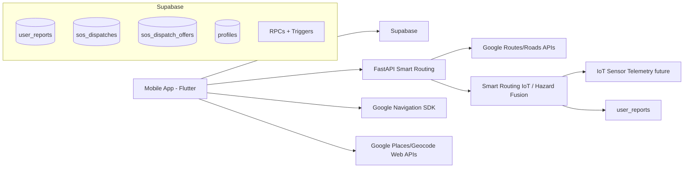
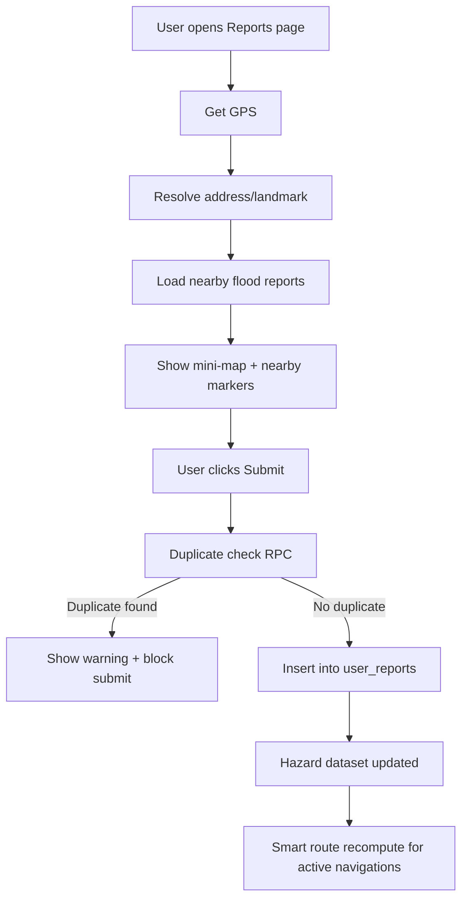
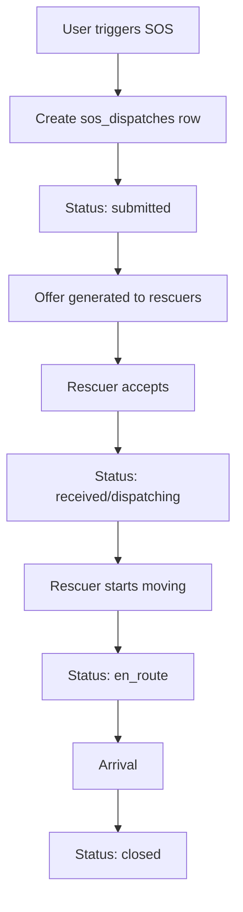
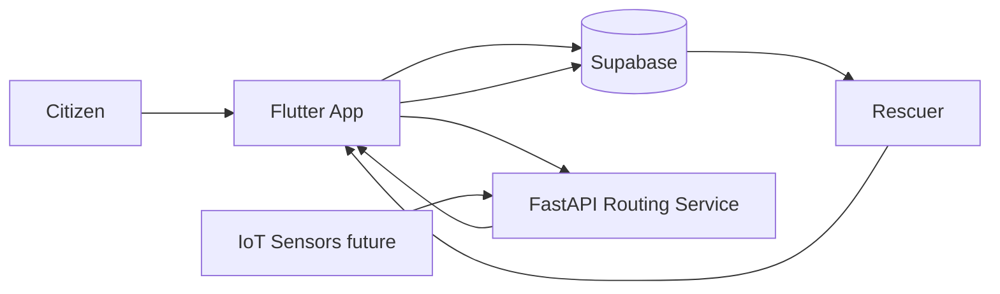

# Floote Flood Reporting & SOS System  
## Smart Routing IoT System — Thesis Defense–Ready Executive Report (Short Version)

## 1) Project Summary (Concise)

Floote is a mobile disaster-response app with two core functions, integrated with a **Smart Routing IoT System** that combines citizen flood data, optional IoT water-level telemetry, and cloud routing services to steer users and rescuers away from impassable roads.

### SOS Dispatch Workflow

- User sends emergency SOS request.
- Request is tracked through statuses (`submitted`, `received`, `dispatching`, `en_route`, `closed`).
- Rescuer receives and navigates to user.

### Incident Flood Reporting Workflow

- User submits flood reports with coordinates and optional photo.
- System prevents duplicate reports in recently reported nearby areas.
- Reports are used as **hazard inputs** for safe routing logic inside the smart routing pipeline.

### Smart Routing IoT System (concise)

- **Inputs:** `user_reports` (crowdsourced hazards), future IoT sensor streams (e.g. water depth), and road network data via Google Routes/Roads (through FastAPI).
- **Processing:** FastAPI evaluates flood-aware routes; the mobile app uses Google Navigation SDK for live guidance; reroute policy favors stability unless hazards or position materially change.
- **Output:** Safer suggested paths for citizens and rescuers, aligned with verified or pending hazard decisions.

The design prioritizes:

- **Safety** — avoid hazardous roads.
- **Data quality** — location normalization + duplicate control.
- **Operational clarity** — status-driven rescue lifecycle.

## 2) Layman’s Explanation (Short)

Think of Floote like this:

- If someone is in danger, they press **SOS** and rescuers get the request.
- If someone sees flooding, they submit a **flood report** with location.
- The app checks if that area was already reported recently to avoid duplicates.
- **Smart routing** uses those reports (and, when deployed, IoT sensors) so navigation avoids dangerous roads and guides users and rescuers more safely.

## 3) Current System Architecture

High-level components:

- **Mobile App (Flutter)** — map, SOS, incident report tab, navigation.
- **Supabase** — auth, `user_reports`, `sos_dispatches`, `sos_dispatch_offers`, `profiles`, RPCs and triggers.
- **FastAPI Backend** — flood-aware routing (`/route` and related services), hazard-aware path computation.
- **Google Routes / Roads APIs** — road-following, route geometry, hazard deflection (via backend keys).
- **Google Navigation SDK** — turn-by-turn guidance on device.
- **Google Places / Geocoding (web-style calls)** — optional address and landmark resolution for reports.

## 4) Core Logic Diagram

### Flood report + duplicate gate + smart routing update

### SOS lifecycle

## 5) End-to-End Workflow Flowchart

## 6) Key Technical Contributions (Defense Points)

- **Separated workflows:** `EmergencyPage` dedicated for SOS; `IncidentReportPage` dedicated for flood reports.
- **Duplicate prevention:** client-side nearby preview + server-side RPC (`is_duplicate_flood_report`) before insert.
- **Improved location quality:** geocode/landmark resolution + fallback label (`Near lat,lng`) when needed.
- **Data consistency:** normalized `admin_decision` values and SQL constraints/triggers on `user_reports` (where deployed).
- **Navigation safety:** hazard-aware routing and strict reroute acceptance for flood-safe results.
- **Smart Routing IoT positioning:** clear extension path from crowdsourced reports to fused IoT+crowd hazard scoring for routing.

## 7) Risks and Mitigations (Short)

- **Risk:** Geocode key restrictions fail and return generic labels.  
  **Mitigation:** fallback to precise `Near lat,lng`; keep accurate coordinates.

- **Risk:** Duplicate spam in same flooded area.  
  **Mitigation:** RPC duplicate radius/time-window validation before insert.

- **Risk:** UI confusion between SOS and reporting.  
  **Mitigation:** separated pages and responsibilities.

- **Risk:** IoT noise or false readings (when sensors are added).  
  **Mitigation:** thresholding, smoothing, and confidence weighting before affecting routes.

## 8) Possible Thesis Defense Questions with Short Answers

**Q: Why separate SOS and incident reporting pages?**  
A: To reduce UX confusion, isolate responsibilities, and simplify maintenance and testing.

**Q: Why use both client and server duplicate checks?**  
A: Client gives immediate UX feedback; server is authoritative and tamper-resistant.

**Q: Why keep lat/lng even if address resolution fails?**  
A: Coordinates are the most reliable source for routing and emergency response.

**Q: What is your duplicate definition?**  
A: A report within configured radius (e.g., 120 m) and recent time window (e.g., 3 hours) with active hazard-related statuses (`pending`, `impassable`, `risky`), as implemented in policy and RPC.

**Q: How does this support rescuer operations?**  
A: Cleaner flood data improves hazard awareness on the map and routing, and avoids redundant low-quality reports.

**Q: What happens without Google geocoding?**  
A: The system still works using GPS plus a coordinate-based fallback label.

**Q: Why use a status lifecycle for SOS dispatch?**  
A: It enables auditable response tracking and operational visibility from `submitted` through `closed`.

**Q: What does “Smart Routing IoT System” add beyond maps?**  
A: It describes the fusion of dynamic hazards (reports + future sensors) with automated route selection and safe rerouting, not only static display.

**Q: Main scalability improvement you would do next?**  
A: Move geocode and heavy hazard fusion to the backend for secure keys, centralized retries, and caching.

## 9) Conclusion

Floote combines **SOS dispatch**, **structured flood reporting**, and a **Smart Routing IoT** vision—crowd and sensor data feeding hazard-aware routing—so the platform supports both immediate rescue and safer everyday navigation during floods.
